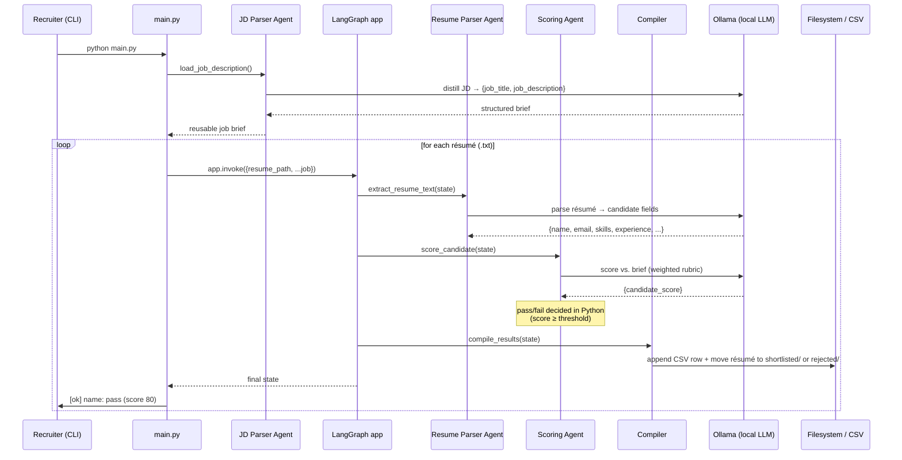
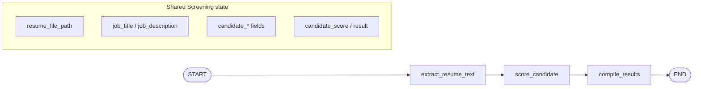

<div align="center">

# 🧠 AI Resume Screener

### An agentic, LLM-powered HR screening pipeline that reads job descriptions, parses résumés, scores candidates, and auto-shortlists — fully local, zero cloud cost.

<p>
  
  
  
  
  
</p>
<p>
  
  
  
  
</p>

</div>

---

## 📖 Table of Contents

- [Overview](#-overview)
- [Features](#-features)
- [Architecture](#-architecture)
- [Workflow](#-workflow)
- [Folder Structure](#-folder-structure)
- [Tech Stack](#-tech-stack)
- [Prerequisites](#-prerequisites)
- [Installation](#-installation)
- [Environment Variables](#-environment-variables)
- [Running Locally](#-running-locally)
- [The Agent Pipeline (LangGraph)](#-the-agent-pipeline-langgraph)
- [Data & Outputs](#-data--outputs)
- [Project Flow](#-project-flow)
- [Security](#-security)
- [Suggested Screenshots & Diagrams](#-suggested-screenshots--diagrams)
- [Roadmap](#-roadmap)
- [Testing](#-testing)
- [Logging](#-logging)
- [Performance Notes](#-performance-notes)
- [Contributing](#-contributing)
- [License](#-license)
- [Contact](#-contact)

---

## 🎯 Overview

**AI Resume Screener** automates the most tedious, time-consuming, and bias-prone stage of recruiting: **first-pass résumé screening**.

Recruiters routinely receive hundreds of résumés per opening. Manually reading each one, matching it to the job requirements, and deciding who moves forward is slow, inconsistent, and expensive. This project replaces that manual triage with a small, deterministic **multi-step LLM pipeline** that behaves like a junior recruiter working under strict, auditable rules.

Drop a job description and a folder of résumés into the project, run one command, and the system will:

1. **Distill** the raw job description into a clean, structured hiring brief.
2. **Parse** every résumé into structured candidate data (skills, experience, education, achievements).
3. **Score** each candidate against the role on a defensible, weighted 0–100 rubric.
4. **Decide** `pass` / `fail` against a configurable threshold.
5. **File** each résumé into `shortlisted/` or `rejected/` and append the result to a **CSV report**.

> [!IMPORTANT]
> The entire pipeline runs **100% locally on Ollama** — no résumé data ever leaves your machine, and there are **no per-token API costs**. This makes it well-suited for handling sensitive candidate PII under GDPR-style constraints.

### Who is this for?

| Audience | Value |
|---|---|
| **Recruiters / HR teams** | Instant, consistent first-pass shortlisting of large candidate pools |
| **Hiring managers** | A defensible, rubric-based score for every candidate |
| **Engineers / Portfolio reviewers** | A clean, production-minded example of **agentic LLM orchestration with LangGraph** |
| **Privacy-sensitive orgs** | Fully offline screening — candidate PII stays on-premise |

---

## ✨ Features

### 🤖 AI & Agentic Workflow
- ✔ **LangGraph orchestration** — screening modeled as an explicit, inspectable state graph
- ✔ **Multi-step agent pipeline** — dedicated *Parsing → Scoring → Compiling* stages, each with its own role-specific system prompt
- ✔ **Structured LLM output** — every model call is constrained to a typed schema (`TypedDict` + `with_structured_output`), so responses are always machine-usable
- ✔ **Prompt-as-config** — all agent instructions live in editable `.txt` files under `prompts/`, decoupled from code
- ✔ **Weighted, defensible scoring rubric** — skills (35%), experience (30%), education (15%), achievements (10%), overall fit (10%)
- ✔ **Deterministic pass/fail** — the threshold decision is enforced in Python, never left to the model

### 🔒 Privacy & Cost
- ✔ **Runs fully offline** on a local Ollama model (`llama3.2:3b` by default)
- ✔ **Zero API cost** — no cloud LLM billing
- ✔ **PII never leaves the machine**

### 🛠️ Engineering
- ✔ **Config-driven** — every path, model, and threshold is set via `.env` (nothing hardcoded)
- ✔ **Resilient batch runner** — one malformed résumé is skipped, not fatal to the batch
- ✔ **Defensive parsing** — safe defaults and score clamping guard against small-model quirks
- ✔ **Automatic file routing** — résumés are physically moved into `shortlisted/` or `rejected/`
- ✔ **CSV audit trail** — one appendable row per candidate for downstream reporting
- ✔ **Provider-flexible** — points at any OpenAI-compatible endpoint via `.env` (Ollama's local server by default)

---

## 🏗️ Architecture

The system is a **local, single-process batch application**. A thin runner (`main.py`) parses the job description once, then invokes a compiled **LangGraph** once per résumé. Each graph run flows through three nodes that read from and write to a shared, typed `Screening` state.

```
                          ┌──────────────────────────┐
                          │        main.py           │
                          │   (batch runner / CLI)   │
                          └────────────┬─────────────┘
                                       │
              parse Job Description ONCE (load_job_description)
                                       │
                                       ▼
                          ┌──────────────────────────┐
             for each     │      LangGraph  app      │
             résumé  ───▶ │   (compiled StateGraph)  │
                          └────────────┬─────────────┘
                                       │  shared typed state: Screening
             ┌─────────────────────────┼─────────────────────────┐
             ▼                         ▼                         ▼
   ┌───────────────────┐   ┌───────────────────┐   ┌───────────────────┐
   │ extract_resume_   │   │  score_candidate  │   │  compile_results  │
   │       text        │──▶│   (LLM: rubric    │──▶│  (CSV + file      │
   │ (LLM: parse PII   │   │    scoring +      │   │   routing to      │
   │  & skills)        │   │    pass/fail)     │   │   shortlist/      │
   └─────────┬─────────┘   └─────────┬─────────┘   │   reject)         │
             │                       │             └─────────┬─────────┘
             ▼                       ▼                       ▼
      ┌────────────┐          ┌────────────┐        ┌──────────────────┐
      │  Ollama    │          │  Ollama    │        │ screening_       │
      │  LLM       │          │  LLM       │        │ results.csv  +   │
      │ (local)    │          │ (local)    │        │ shortlisted/ /   │
      └────────────┘          └────────────┘        │ rejected/        │
                                                     └──────────────────┘
```

### Component responsibilities

| Component | File | Responsibility |
|---|---|---|
| **Batch runner** | `main.py` | Discovers `.txt` résumés, parses the JD once, invokes the graph per candidate, prints a summary |
| **Graph definition** | `workflows/graph.py` | Wires the three nodes into a linear `StateGraph` and compiles it into `app` |
| **Shared state** | `workflows/state.py` | `Screening` `TypedDict` — the contract every node reads/writes |
| **Agent nodes** | `agents/nodes.py` | The four functions: `load_job_description`, `extract_resume_text`, `score_candidate`, `compile_results` |
| **LLM binding** | `agents/models.py` | Instantiates `ChatOllama` from config |
| **Output schemas** | `agents/schemas.py` | Typed structures that constrain each LLM response |
| **Configuration** | `config.py` | Resolves all paths, model names, and thresholds from `.env` |
| **Prompts** | `prompts/*.txt` | Role-specific system prompts for each LLM stage |

---

## 🔄 Workflow



### Step-by-step

1. **Launch** — the recruiter runs `python main.py`.
2. **JD parsing (once)** — the raw job description is distilled into a dense, structured brief that downstream scoring can rely on. Doing this once (not per résumé) saves redundant LLM calls.
3. **Résumé parsing** — each résumé is extracted into typed candidate fields; nothing is inferred or fabricated (enforced by the prompt).
4. **Scoring** — the candidate is compared to the brief on a weighted rubric and assigned a 0–100 score.
5. **Decision** — Python (not the model) applies the `PASS_SCORE_THRESHOLD` to produce a stable `pass`/`fail` label.
6. **Compilation** — the result is appended to the CSV report and the résumé file is moved into the appropriate folder.
7. **Summary** — a per-candidate line is printed and the report path is reported.

---

## 📁 Folder Structure

```
ai_resume_screener/
├── main.py                     # Batch runner / CLI entry point
├── config.py                   # Central, .env-driven configuration
├── requirements.txt            # Pinned Python dependencies
├── .env.example                # Template for environment variables
│
├── agents/                     # LLM binding, agent nodes, and output schemas
│   ├── models.py               #   → ChatOllama instance
│   ├── nodes.py                #   → load_job_description / extract / score / compile
│   └── schemas.py              #   → TypedDict structured-output contracts
│
├── workflows/                  # LangGraph orchestration
│   ├── graph.py                #   → StateGraph wiring + compiled `app`
│   └── state.py                #   → Screening state (TypedDict)
│
├── prompts/                    # Editable system prompts (one per agent)
│   ├── read_job_description.txt
│   ├── extract_resume_data.txt
│   └── score_candidate.txt
│
├── descriptions/               # Input: the job description to screen against
│   └── job_description.txt
│
├── resumes/                    # Input: drop .txt résumés here
├── shortlisted/                # Output: résumés that PASSED (auto-filed)
├── rejected/                   # Output: résumés that FAILED (auto-filed)
├── reports/                    # Output: screening_results.csv
└── logs/                       # Reserved for run logs
```

> [!NOTE]
> `shortlisted/`, `rejected/`, `reports/`, and `logs/` are kept in git via `.gitkeep`, but their generated contents are `.gitignore`d. Résumés are **moved** (not copied) at runtime, so a screened résumé leaves `resumes/` and lands in its verdict folder.

---

## 🧰 Tech Stack

| Category | Technology |
|---|---|
| **Language** | Python 3.12+ |
| **Agent Orchestration** | [LangGraph](https://langchain-ai.github.io/langgraph/) `1.2` |
| **LLM Framework** | [LangChain](https://python.langchain.com/) `1.3` (`langchain-core`) |
| **LLM Runtime** | [Ollama](https://ollama.com/) (local) via `langchain-ollama` |
| **Default Model** | `llama3.2:3b` (configurable) |
| **Data Validation** | Pydantic 2 / `TypedDict` structured output |
| **Config** | `python-dotenv` |
| **Output** | CSV (Python stdlib `csv`) + filesystem routing |

> [!NOTE]
> `requirements.txt` also pins `langchain-openai`, `boto3`, and `openai`. The active pipeline uses **only Ollama** (`agents/models.py`), but the `.env` is structured around an OpenAI-compatible base URL, so swapping in a hosted OpenAI-compatible provider is a small change. These extra packages are not exercised by the current graph.

---

## ✅ Prerequisites

Before running the project you need:

- **Python 3.12+** and `pip`
- **[Ollama](https://ollama.com/download)** installed and running locally
- The default model pulled:
  ```bash
  ollama pull llama3.2:3b
  ```
- **Git** (to clone the repo)
- ~2–4 GB free RAM for the 3B model (more for larger models)

> [!TIP]
> No GPU is required for `llama3.2:3b`, but a GPU noticeably speeds up scoring on larger batches.

---

## ⚙️ Installation

```bash
# 1. Clone the repository
git clone https://github.com/Mohsin66/ai_resume_screener.git
cd ai_resume_screener

# 2. Create and activate a virtual environment
python3 -m venv .venv
source .venv/bin/activate        # Windows: .venv\Scripts\activate

# 3. Install dependencies
pip install -r requirements.txt

# 4. Configure environment
cp .env.example .env             # then edit values if needed

# 5. Make sure Ollama is running and the model is available
ollama pull llama3.2:3b

# 6. Add inputs
#    - put your job description in descriptions/job_description.txt
#    - drop .txt résumés into resumes/

# 7. Run
python main.py
```

**Verify installation** — you should see output like:

```
Screening 3 resume(s) for: Senior Backend Engineer (Python)

[ok]   aisha_khan.txt: pass (score 80)
[ok]   tom_becker.txt: fail (score 0)
[ok]   maria_lopez.txt: fail (score 0)

Done. Report: .../reports/screening_results.csv
```

---

## 🔐 Environment Variables

All configuration is loaded from `.env` (see `config.py`). Copy `.env.example` → `.env` and adjust as needed.

| Variable | Required | Purpose | Example / Default |
|---|:---:|---|---|
| `OPENAI_API_KEY` | ❌ | API key if using a hosted OpenAI-compatible provider (unused with local Ollama) | *(empty)* |
| `OPENAI_BASE_URL` | ❌ | OpenAI-compatible endpoint | `http://localhost:11434/v1` |
| `LLM_MODEL_NAME` | ✅ | Ollama model used by the graph | `llama3.2:3b` |
| `OPENAI_MODEL_NAME` | ❌ | Model name for a hosted provider | `gpt-4o-mini` |
| `LLM_TEMPERATURE` | ❌ | Sampling temperature (low = deterministic) | `0.2` |
| `LLM_MAX_TOKENS` | ❌ | Max generation tokens | `2000` |
| `LLM_REQUEST_TIMEOUT` | ❌ | Per-request timeout (seconds) | `120` |
| `PASS_SCORE_THRESHOLD` | ✅ | Minimum score (0–100) to be shortlisted | `60` |
| `RESUME_DIR` | ❌ | Input résumés folder | `resumes` |
| `SHORTLIST_DIR` | ❌ | Output for passing résumés | `shortlisted` |
| `REJECTED_DIR` | ❌ | Output for failing résumés | `rejected` |
| `REPORTS_DIR` | ❌ | Report output folder | `reports` |
| `JOB_DESCRIPTION_FILE` | ❌ | Path to the job description | `descriptions/job_description.txt` |
| `REPORT_FILE` | ❌ | CSV report path | `reports/screening_results.csv` |
| `JD_PROMPT_FILE` | ❌ | JD-parsing system prompt | `prompts/read_job_description.txt` |
| `RESUME_PROMPT_FILE` | ❌ | Résumé-parsing system prompt | `prompts/extract_resume_data.txt` |
| `SCORE_PROMPT_FILE` | ❌ | Scoring system prompt | `prompts/score_candidate.txt` |

> [!WARNING]
> Never commit your real `.env`. It is already listed in `.gitignore`. Commit only `.env.example`.

---

## ▶️ Running Locally

The application is a **CLI batch job**. There is currently no web server or API.

**Standard run**

```bash
python main.py
```

**Screen against a different job description** — edit `descriptions/job_description.txt` (or point `JOB_DESCRIPTION_FILE` in `.env` at another file), then re-run.

**Adjust strictness** — raise or lower `PASS_SCORE_THRESHOLD` in `.env` (e.g. `70` for a tighter shortlist).

**Use a stronger model** — pull it with Ollama and set `LLM_MODEL_NAME` (e.g. `llama3.1:8b`):

```bash
ollama pull llama3.1:8b
# .env → LLM_MODEL_NAME=llama3.1:8b
python main.py
```

> [!NOTE]
> Only **plain-text (`.txt`) résumés** are supported today. PDF/DOCX parsing is on the [roadmap](#-roadmap).

---

## 🧩 The Agent Pipeline (LangGraph)

The graph is a **linear three-node state machine** compiled from `workflows/graph.py`. The job description is parsed **outside** the graph (once) and injected into every run.



### Nodes

| Node | Input (from state) | LLM? | Output (into state) |
|---|---|:---:|---|
| `load_job_description` *(pre-graph, runs once)* | `descriptions/job_description.txt` | ✅ | `job_title`, `job_description` |
| `extract_resume_text` | `resume_file_path` | ✅ | `candidate_name/email/phone/skills/experience/education/achievements` |
| `score_candidate` | candidate fields + job brief | ✅ | `candidate_score`, `result` (pass/fail) |
| `compile_results` | full state | ❌ | writes CSV row + moves file |

### State contract (`workflows/state.py`)

```python
class Screening(TypedDict):
    resume_file_path: str
    job_title: str
    job_description: str
    candidate_name: str
    candidate_email: str
    candidate_phone: str
    candidate_skills: list[str]
    candidate_experience: list[str]
    candidate_education: list[str]
    candidate_achievements: list[str]
    candidate_score: int
    result: Literal["pass", "fail"]
```

### Design decisions worth noting

- **The threshold is applied in Python, not by the LLM.** The model returns a numeric score; `score_candidate` clamps it to `0–100` and derives `pass`/`fail`, so the label can never disagree with the number.
- **Defensive defaults everywhere.** Small models occasionally omit a field; each node substitutes `""`/`[]`/`0` rather than crashing.
- **Prompts are data, not code.** Tuning the recruiter's behavior is a text edit under `prompts/`, no code change required.

---

## 🗃️ Data & Outputs

This project uses the **filesystem as its data store** — there is no database.

### CSV report (`reports/screening_results.csv`)

One appendable row per screened candidate; a header is written on first run.

| candidate_name | candidate_email | candidate_phone | candidate_score | result |
|---|---|---|:---:|:---:|
| Aisha Khan | aisha.khan@example.com | +49 151 2345 6789 | 80 | pass |
| Tom Becker | tom.becker@example.com | +49 160 9988 7766 | 0 | fail |
| Maria Lopez | maria.lopez@example.com | +34 612 345 678 | 0 | fail |

### File routing

- **Passing** résumés → `shortlisted/`
- **Failing** résumés → `rejected/`

Files are **moved** with `shutil.move` (works across filesystems); a stale copy from a prior run is overwritten.

---

## 🔁 Project Flow

```
   Recruiter
       │  python main.py
       ▼
   main.py ──── discover .txt résumés in resumes/
       │
       ▼
   load_job_description() ── LLM ──▶ structured job brief (parsed once)
       │
       ▼
   for each résumé:
       │
       ├─▶ extract_resume_text ── LLM ──▶ structured candidate profile
       │
       ├─▶ score_candidate ────── LLM ──▶ score  ──▶ Python applies threshold ──▶ pass/fail
       │
       └─▶ compile_results ──────────────▶ append CSV row
                                          └▶ move résumé → shortlisted/ | rejected/
       │
       ▼
   Summary printed + report path reported
```

---

## 🛡️ Security

| Area | Implementation |
|---|---|
| **Data privacy** | Fully offline inference — candidate PII never leaves the local machine |
| **Secrets management** | All secrets/config in `.env`, which is `.gitignore`d; only `.env.example` is committed |
| **No hardcoded config** | Every path, model, and threshold is resolved from environment variables via `config.py` |
| **Input isolation** | Résumés are read as text and passed to the model; no code from résumés is executed |
| **Deterministic decisions** | The pass/fail gate is enforced in Python, insulating the verdict from prompt-injection attempts to force a label |
| **Batch resilience** | A malformed résumé raises inside its own run and is skipped; the batch continues |

> [!WARNING]
> The current version does **not** sanitize résumé content against prompt-injection at the parsing/scoring layer (e.g. a résumé instructing the model to "score 100"). Scoring is partially protected because the final label is computed in Python, but score inflation is possible. Hardening this is on the [roadmap](#-roadmap).

---

## 🖼️ Suggested Screenshots & Diagrams

To make this README even more compelling on GitHub, add the following visuals (the Mermaid diagrams above already render natively on GitHub):

| Image | Purpose | Suggested placement |
|---|---|---|
| **CLI run recording** (GIF/asciinema) | Show the end-to-end run and summary output | Top of README / Overview |
| **Architecture diagram** (polished) | Visual of runner → graph → nodes → outputs | Architecture section |
| **LangGraph node graph** | Rendered `extract → score → compile` graph | Agent Pipeline section |
| **CSV report screenshot** | Show a real `screening_results.csv` in a viewer | Data & Outputs section |
| **Before/after folders** | `resumes/` emptying into `shortlisted/` & `rejected/` | Data & Outputs section |

---

## 🗺️ Roadmap

- [ ] **PDF & DOCX parsing** (currently `.txt` only)
- [ ] **Prompt-injection hardening** for résumé content
- [ ] **Web UI / REST API** (e.g. FastAPI) for non-technical recruiters
- [ ] **Database persistence** (e.g. PostgreSQL) to replace CSV + folders
- [ ] **Per-candidate scoring rationale** (explainable "why this score")
- [ ] **Hosted-provider support** (wire up the already-present OpenAI-compatible config)
- [ ] **Concurrent/async batch processing** for large candidate pools
- [ ] **Structured logging** into the reserved `logs/` directory
- [ ] **Automated test suite** and CI
- [ ] **Dockerfile** for one-command reproducible runs

---

## 🧪 Testing

> [!NOTE]
> There is **no automated test suite yet** (see the [roadmap](#-roadmap)). The project ships with sample data for manual verification.

Manual smoke test:

```bash
# The repo includes a sample job description and sample résumés.
python main.py
# Confirm: résumés move into shortlisted/ or rejected/,
# and reports/screening_results.csv gains one row per candidate.
```

---

## 🧾 Logging

The `logs/` directory is reserved for run logs. The current version prints a concise per-candidate status line and a final report path to **stdout**:

```
[ok]   aisha_khan.txt: pass (score 80)
[skip] broken_resume.txt: <error message>
```

Structured file-based logging into `logs/` is planned.

---

## ⚡ Performance Notes

- **JD parsed once, not per résumé** — the job description is distilled a single time in `main.py` and reused for the whole batch, eliminating N redundant LLM calls.
- **Low temperature (`0.2`)** — favors stable, repeatable scores over creative variance.
- **Small default model (`llama3.2:3b`)** — fast on CPU; trade up to a larger Ollama model for higher-quality scoring at the cost of speed.
- **Fail-soft batching** — one bad résumé never aborts the run.

> [!TIP]
> Screening is currently **sequential**. For large candidate pools, the biggest win is concurrent processing (roadmap item) since each résumé's run is independent.

---

## 🤝 Contributing

Contributions are welcome!

1. **Fork** the repository and create a feature branch:
   ```bash
   git checkout -b feature/your-feature
   ```
2. Make your changes, keeping the existing style:
   - No hardcoded paths/models — add config to `.env` + `config.py`.
   - Keep agent instructions in `prompts/*.txt`, not inline strings.
   - Nodes should read/write the `Screening` state and fail defensively.
3. Test locally with the sample data.
4. **Commit** with a clear message and open a **Pull Request** describing the change and motivation.

Good first issues: PDF/DOCX parsing, structured logging, a small test suite, or a FastAPI wrapper.

---

## 📄 License

Released under the **MIT License**.

> [!NOTE]
> A `LICENSE` file is not yet present in the repository. Add one (`MIT` recommended) to make the terms official.

---

## 📬 Contact

**Mohsin** — *Author & Maintainer*

- 🐙 GitHub: [@Mohsin66](https://github.com/Mohsin66)
- 📦 Repository: [ai_resume_screener](https://github.com/Mohsin66/ai_resume_screener)
- 💼 LinkedIn: `<add your profile>`
- 🌐 Portfolio: `<add your site>`
- ✉️ Email: `<add your email>`

---

<div align="center">

⭐ **If this project helped or impressed you, consider starring the repo!** ⭐

<sub>Built with LangGraph · LangChain · Ollama — runs entirely on your own machine.</sub>

</div>
